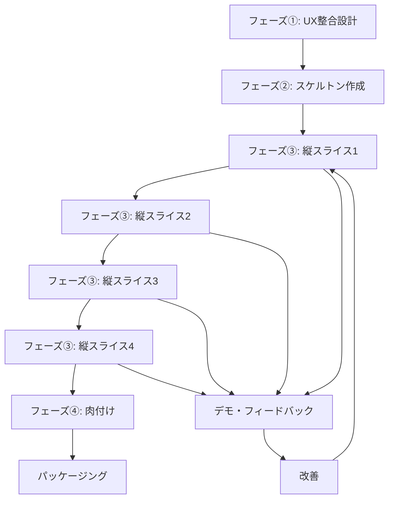

# VSEAとは

## 定義

VSEA (Vertical Slice Evolutionary Architecture)は、**機能を縦に切って段階的に実装していく開発手法**です。

従来の横割り(レイヤー分割)ではなく、**機能単位の縦割り**で開発を進めることで、常に動作するシステムを維持しながら進化させます。

## 3つの核心概念

### 1. Vertical Slice (縦スライス)

機能をUI層からデータ層まで**end-to-end**で実装する単位。

```
横割り(従来):
┌──────────────┐
│   UI層       │ ← 全機能のUI実装
├──────────────┤
│ ビジネス層   │ ← 全機能のロジック実装
├──────────────┤
│  データ層    │ ← 全機能のデータ処理実装
└──────────────┘
問題: すべて完成しないと動かない

縦割り(VSEA):
┌────┬────┬────┐
│UI  │UI  │UI  │
├────┼────┼────┤
│Logic│Logic│Logic│
├────┼────┼────┤
│Data│Data│Data│
└────┴────┴────┘
 機能A 機能B 機能C
利点: 各機能が独立して動作
```

### 2. Evolutionary (進化的)

一度に完璧を目指さず、**段階的に機能を追加・改善**していく。

- 最小限の機能から開始(MVP)
- フィードバックを得ながら進化
- 要件変更に柔軟に対応

### 3. Architecture (アーキテクチャ)

進化的でありながら、**一貫したアーキテクチャ**を維持。

- インターフェースの事前設計
- モジュール間の疎結合
- 技術的負債の最小化

## VSEAが解決する問題

| 従来の問題 | VSEAの解決策 |
|-----------|------------|
| 全部実装し終わるまで動かない | 各スライス完了時点で動作確認可能 |
| 後工程で大きな問題発覚 | 各スライスで問題を早期発見 |
| 要件変更が大規模改修に | 既存スライスを壊さず追加改善 |
| 技術的負債が蓄積 | 段階的複雑性増加で負債最小化 |
| 進捗が見えにくい | 各スライス完了が明確な指標 |

## 5つの基本原則

### 原則1: 各スライスは独立して動作可能

**NG例**: ログイン機能だけ実装(データ取得機能なし)

**OK例**: ログイン + 最小限のデータ表示までをセットで実装

### 原則2: 1-2時間で完了するサイズ

**粒度の目安**:
- **小さすぎる**: ボタン1個追加(0.5時間) → 小さすぎ
- **適切**: CSV読込 + 検証 + GUI表示(1.5時間) → 適切
- **大きすぎる**: 全機能を一気に実装(5時間) → 大きすぎ

### 原則3: インターフェース優先設計

実装前に各モジュールのインターフェースを定義:

```python
# フェーズ②で定義
class DataReader:
    def read(self, filepath: str) -> DataFrame:
        """データ読込"""
        pass

    def validate(self, data: DataFrame) -> bool:
        """データ検証"""
        pass
```

### 原則4: 段階的な複雑性増加

```
Slice 1: シンプルな機能(基礎)
    ↓
Slice 2: やや複雑な機能(応用)
    ↓
Slice 3: 複雑な機能(統合)
    ↓
Slice 4: 高度な機能(最適化)
```

### 原則5: 常にリリース可能な状態を維持

各スライス完了後:
- ✅ 動作確認完了
- ✅ テスト実施済み
- ✅ ドキュメント更新
- ✅ いつでもリリース可能

## VSEAの開発フロー



## 他手法との比較

### vs ウォーターフォール

| 項目 | ウォーターフォール | VSEA |
|-----|-----------------|------|
| リスク | 高い | 低い |
| 変更対応 | 困難 | 容易 |
| フィードバック | 遅い | 早い |
| 心理的安全性 | 低い | 高い |

### vs アジャイル/スクラム

**類似点**:
- 反復的開発
- フィードバック重視
- 段階的な価値提供

**VSEAの独自性**:
- **縦スライス**の概念
- **フェーズ構成**の明確化
- **アーキテクチャ**への注力

VSEAはアジャイルの**具体的な実装手法**として位置づけられます。

## まとめ

VSEAの核心は以下の3点:

1. **縦に切る**: 機能をend-to-endで実装
2. **段階的に進化**: MVPから徐々に改善
3. **アーキテクチャ維持**: 一貫した設計を保つ

次の章からは、各フェーズの詳細な実施手順を見ていきます。
